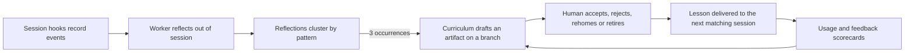

# self-improvement-loop

**A Claude Code plugin that learns from your sessions.** It reflects on them in
the background, promotes recurring lessons into skills, hooks, rules and agents,
and tracks whether those artifacts actually get used. Nothing reaches a shared
remote without a human.

[](https://github.com/kolezka/self-improvement-loop/actions/workflows/ci.yml)
[](https://github.com/kolezka/self-improvement-loop/releases)
[](LICENSE)
[](https://bun.sh)

OpenClaw sessions feed the same loop. See [`docs/OPENCLAW.md`](docs/OPENCLAW.md).

## Contents

- [How the loop works](#how-the-loop-works)
- [Requirements](#requirements)
- [Install](#install)
- [Quick start](#quick-start)
- [Commands](#commands)
- [How lessons reach a session](#how-lessons-reach-a-session)
- [Feedback and scorecards](#feedback-and-scorecards)
- [Configuration](#configuration)
- [Worlds](#worlds)
- [Model providers](#model-providers)
- [Patterns and aliases](#patterns-and-aliases)
- [Privacy](#privacy)
- [Development](#development)
- [Documentation](#documentation)
- [License](#license)

## How the loop works



Hooks record what happened in a session. They are fast, one bundled script,
never blocking, and they never call a model. A worker, running on a schedule
outside any session, reflects on sessions that ended or went idle: it builds
evidence from the transcript, makes one model call, and writes a reflection if
there is a real lesson.

Reflections cluster by pattern. Three occurrences of the same pattern trigger
curriculum, which drafts and stages an artifact on a branch. You review and
accept it (or reject, rehome, retire it) in the web UI or the CLI. Once
accepted, the next session that matches gets the lesson delivered as context,
and usage of the new artifact starts feeding a scorecard that the next
curriculum pass reads.

See [`docs/ARCHITECTURE.md`](docs/ARCHITECTURE.md) for the full picture and
[`docs/V1-PARITY.md`](docs/V1-PARITY.md) for what carried over from the previous
(`dotfiles-next`) version of this loop and what changed.

## Requirements

| Requirement | Notes |
| --- | --- |
| `bun` >= 1.4.2 | Runs every part of the plugin: hook fast path, CLI, worker, web UI. |
| `git` | Artifacts are staged on a branch in a target repo. |
| A model endpoint | An OpenAI-compatible proxy (LiteLLM, Ollama) or the `claude` CLI on `PATH`. |

## Install

```sh
claude plugin marketplace add kolezka/marketplace
claude plugin install self-improvement-loop@kolezka
```

See [`docs/INSTALL.md`](docs/INSTALL.md) for local dev installs and running on a
schedule.

## Quick start

```sh
sil init   # write config templates and a learned/ repo for the default world
sil web    # open the local review UI
```

`sil init` writes `config.yaml` and `llm.yaml` templates and a `learned/` repo
for the default world. Edit `llm.yaml` and set `models.critic`,
`models.drafter` and `models.judge` before the worker can call a model.

## Commands

| Command | What it does |
| --- | --- |
| `sil init` | Write config templates and the default world. |
| `sil status` | Show worlds, queue, worker state and model wiring. |
| `sil web` | Serve the local review UI. |
| `sil worker --once` | Run one reflection pass by hand. |
| `sil curriculum` | Run a promotion pass over clustered reflections. |
| `sil review` | Review staged artifacts from the terminal. |
| `sil artifacts` | List artifacts with their scorecards. |
| `sil feedback add <artifact> good\|bad` | Rate an artifact. |
| `sil worlds` | Add, list and edit worlds. |
| `sil llm` | Inspect and switch model endpoints per role. |
| `sil aliases` | Fold near-duplicate pattern slugs together. |

The plugin also ships slash commands: `/loop`, `/reflect`, `/curriculum` and
`/feedback`.

## How lessons reach a session

`SessionStart` and `UserPromptSubmit` hooks inject up to a few undelivered
lessons for the current world as `additionalContext`. A lesson is delivered
once, then marked so it is never repeated in a later session.

## Feedback and scorecards

```sh
/feedback skill:verify-callsites good "caught a real bug"
```

or

```sh
sil feedback add skill:verify-callsites good --note "caught a real bug"
```

Votes, tool and agent invocation counts, nudge fires and critic-noticed
helpful/misfire signals all fold into a per-artifact scorecard (`sil
artifacts`). The curriculum planner reads scorecards and proposes `refine` or
`retire-candidate`; a human still decides.

## Configuration

| File | Contents |
| --- | --- |
| `~/.config/self-improvement-loop/config.yaml` | Worlds, promotion thresholds, worker cadence, web UI port. |
| `~/.config/self-improvement-loop/llm.yaml` | Model endpoints and the three model roles (`critic`, `drafter`, `judge`). |

Each endpoint carries its own model names. `sil llm list` shows which endpoint
serves each role, `sil llm use <endpoint>` switches all three, and `sil llm use
<endpoint> --role critic` switches one.

## Worlds

A world owns its own reflections, ledger, target repo and model policy. Sessions
map to a world by the longest `repos` prefix match on `cwd`; a world with no
`repos` is the catch-all.

```sh
sil worlds add work --repos ~/Development/work --target ~/dotfiles --llm cloud
```

To keep a V1 (`dotfiles-next`) target repo's on-disk contract
(`claude/skills`, `claude/hooks/nudges`, `claude/agents`, `global.CLAUDE.md`,
`claude/skills/promotions.json`), add `--layout v1`:

```sh
sil worlds add legacy --target ~/dotfiles --layout v1
```

A V1 `worlds.yaml` manifest imports directly:

```sh
sil worlds import-kb ~/.config/kb/worlds.yaml
```

## Model providers

`llm.yaml` supports three endpoint kinds:

| Kind | Use it for |
| --- | --- |
| `openai` | Any OpenAI-compatible endpoint, including a local LiteLLM proxy or Ollama. |
| `claude-cli` | Shells out to `claude -p --model <model>`, no proxy needed. |
| `system-one` | A typed-decision API such as Jev or Laya. Only the judge role can run on it, see [`docs/OPERATIONS.md`](docs/OPERATIONS.md). |

A role picks its endpoint from `role_endpoints`, else `active`, so the critic
can run on `claude -p` while the drafter and judge stay on the proxy. Every chat
call runs at temperature 0 for reproducibility. A world set to `llm: local` may
only use models in `llm.yaml`'s `local_models` allowlist; the loop refuses
rather than silently falling back to a cloud model.

## Patterns and aliases

Reflections cluster by their `Pattern:` slug, and the match is exact. Two
reflections about the same mechanism under different slugs never reach the
promotion threshold together. The alias map folds one into the other, one hop
only:

```sh
sil aliases suggest          # near-duplicate slugs, by token overlap
sil aliases set stale-env stale-cached-env
sil aliases list
```

`suggest` is deterministic and calls no model. It proposes; you apply. `set`
re-points any alias that pointed at the slug you just aliased, so a two hop
chain (which would resolve to nothing) can never form.

## Privacy

Reflections, the ledger, scorecards and the queue all live on disk under
`~/.local/state/self-improvement-loop/` and
`~/.local/share/self-improvement-loop/`. Only the critic, drafter and judge
calls leave the machine, to whatever endpoint you configured. Curriculum never
pushes to a remote on its own; accept is a human action, and `remote: push|pr`
is an explicit per-world opt-in on top of that.

## Development

The repo is a Bun workspace: `apps/` (cli, hook, server, web) and `packages/`
(core, critic, curriculum, feedback, nudges, openclaw, ops, providers, review,
store, transcript, worker).

```sh
make install       # bun install
make build         # build dist/, which the hooks run
make test          # bun test
make typecheck     # tsc --noEmit
make lint-dashes   # fail on an em dash or en dash in tracked text
make dev-install   # claude --plugin-dir $(CURDIR)
```

`dist/` is untracked and the hooks run `dist/hook.js`, so `make build` is not
optional for a local dev install.

## Documentation

| Document | Contents |
| --- | --- |
| [`docs/ARCHITECTURE.md`](docs/ARCHITECTURE.md) | Design rules, runtime layout, full loop mechanics. |
| [`docs/INSTALL.md`](docs/INSTALL.md) | Marketplace install, local dev install, scheduling. |
| [`docs/OPERATIONS.md`](docs/OPERATIONS.md) | Daily loop, reviewing, key rotation, troubleshooting. |
| [`docs/OPENCLAW.md`](docs/OPENCLAW.md) | Running the loop on OpenClaw sessions. |
| [`docs/BENCHMARK.md`](docs/BENCHMARK.md) | Engine benchmark: hook fast path, worker, curriculum, API timings. |
| [`docs/RELEASE.md`](docs/RELEASE.md) | How a version is cut and where the installed `dist/` comes from. |
| [`docs/V1-PARITY.md`](docs/V1-PARITY.md) | What carried over from V1 and what changed. |

## License

Source-available under the [PolyForm Noncommercial License 1.0.0](LICENSE)
(SPDX: `PolyForm-Noncommercial-1.0.0`). Any noncommercial use is free: run it,
study it, change it, share it. That covers personal and hobby use, research, and
use by schools, charities, public research bodies and government institutions.

Commercial use is not granted by that license. See
[COMMERCIAL-LICENSE.md](COMMERCIAL-LICENSE.md) or contact mariusz@raqz.pl.

This license is not OSI-approved, because it restricts a field of endeavour.
Call it source-available, not open source.
