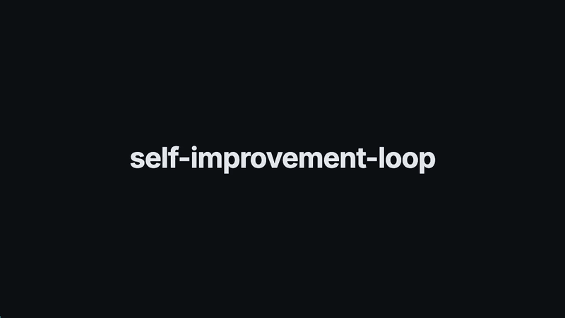
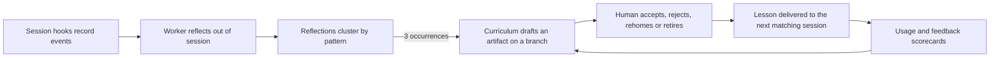

# self-improvement-loop

**A Claude Code plugin that learns from your sessions.** It reflects on them in
the background, promotes recurring lessons into skills, hooks, rules and agents,
and tracks whether those artifacts actually get used. Nothing reaches a shared
remote without a human. A Codex agent can operate the same loop through the
same skill.

[](https://github.com/kolezka/self-improvement-loop/actions/workflows/ci.yml)
[](https://github.com/kolezka/self-improvement-loop/releases)
[](LICENSE)
[](https://bun.sh)



About 30 seconds, no sound. Also as [MP4](docs/media/demo.mp4).

## Contents

- [How the loop works](#how-the-loop-works)
- [Hosts: Claude Code, Codex, OpenClaw](#hosts-claude-code-codex-openclaw)
- [Requirements](#requirements)
- [Install](#install)
- [Quick start](#quick-start)
- [Using the loop from an agent](#using-the-loop-from-an-agent)
- [CLI reference](#cli-reference)
- [Reviewing a staged artifact](#reviewing-a-staged-artifact)
- [How lessons reach a session](#how-lessons-reach-a-session)
- [Feedback and scorecards](#feedback-and-scorecards)
- [Configuration](#configuration)
- [Worlds](#worlds)
- [Model providers](#model-providers)
- [Patterns and aliases](#patterns-and-aliases)
- [Moving to another host](#moving-to-another-host)
- [Privacy](#privacy)
- [Troubleshooting](#troubleshooting)
- [Development](#development)
- [Documentation](#documentation)
- [License](#license)

## How the loop works


```mermaid
flowchart LR
  A[Session hooks record events] --> B[Worker reflects out of session]
  B --> C[Reflections cluster by pattern]
  C -->|3 occurrences| D[Curriculum drafts an artifact on a branch]
  D --> E[Human accepts, rejects, rehomes or retires]
  E --> F[Lesson delivered to the next matching session]
  F --> G[Usage and feedback scorecards]
  G --> D
```

Hooks record what happened in a session. They are fast, one bundled script,
never blocking, and they never call a model. A worker, running on a schedule
outside any session, reflects on sessions that ended or went idle: it builds
evidence from the transcript, makes one model call, and writes a reflection if
there is a real lesson.

Reflections cluster by pattern. Three occurrences of the same pattern trigger
curriculum, which drafts and stages an artifact on a branch. You review and
accept it (or reject, rehome, retire it) in the web UI or the CLI. Once
accepted, the next session that matches gets the lesson delivered as context,
and usage of the new artifact starts feeding a scorecard that the next
curriculum pass reads.

See [`docs/ARCHITECTURE.md`](docs/ARCHITECTURE.md) for the full picture and
[`docs/V1-PARITY.md`](docs/V1-PARITY.md) for what carried over from the previous
(`dotfiles-next`) version of this loop and what changed.

## Hosts: Claude Code, Codex, OpenClaw

The engine is the `sil` CLI. A host is an agent whose sessions feed the loop,
or whose agent operates it.

| | Claude Code | Codex | OpenClaw |
| --- | --- | --- | --- |
| Sessions feed the loop | yes, plugin hooks | no | yes, plugin or `sil openclaw scan` |
| Lessons delivered | `SessionStart` and `UserPromptSubmit` context | no, `sil lessons` reads them | managed block in `AGENTS.md` |
| Skill use counted | yes | no | yes, on a read of the `SKILL.md` |
| Agent skill | ships with the plugin | `sil codex install` | `sil openclaw install` |
| Slash commands | `/reflect`, `/loop`, `/curriculum`, `/feedback` | none | none |

Claude Code and Codex load the same skill file,
[`skills/self-improvement-loop/SKILL.md`](skills/self-improvement-loop/SKILL.md).
OpenClaw has its own, because lessons reach it a different way. See
[`docs/OPENCLAW.md`](docs/OPENCLAW.md).

## Requirements

| Requirement | Notes |
| --- | --- |
| `bun` >= 1.4.2 | Runs every part of the plugin: hook fast path, CLI, worker, web UI. |
| `git` | Artifacts are staged on a branch in a target repo. |
| A model endpoint | An OpenAI-compatible proxy (LiteLLM, Ollama) or the `claude` CLI on `PATH`. |
| Codex CLI (optional) | Only to operate the loop from Codex. |

## Install

```sh
claude plugin marketplace add kolezka/marketplace
claude plugin install self-improvement-loop@kolezka
```

In any Claude Code session, `/loop` then prints status and confirms the plugin
is wired up.

To operate the loop from Codex as well, run the plugin's own copy of the CLI
once (no `sil` shim exists yet):

```sh
~/.claude/plugins/cache/kolezka/self-improvement-loop/<version>/scripts/sil codex install
```

It copies the skill to `~/.agents/skills/self-improvement-loop/SKILL.md`, where
Codex finds it, and writes the `sil` shim to `~/.local/bin/sil`. Both are
copies, so run `sil codex install` again after a plugin update. A symlink you
put at either path is left alone.

See [`docs/INSTALL.md`](docs/INSTALL.md) for local dev installs, the web UI on
another machine, and running on a schedule.

## Quick start

Until a shim exists, call the plugin's own copy of the CLI. Claude Code keeps it
under its plugin cache:

```sh
SIL=~/.claude/plugins/cache/kolezka/self-improvement-loop/<version>/scripts/sil
"$SIL" init                     # config templates and a learned/ repo for the default world
$EDITOR ~/.config/self-improvement-loop/llm.yaml   # set models.critic, models.drafter, models.judge
"$SIL" status                   # worlds, queue, worker and model wiring
"$SIL" schedule install --web   # worker on a timer, web UI as a service, shim in ~/.local/bin
sil status                      # from here on, plain sil
```

The worker cannot call a model until `llm.yaml` names a model for each of the
three roles. After `sil schedule install`, plain `sil` works from any shell
that has `~/.local/bin` on `PATH`, and the web UI answers at
`http://127.0.0.1:8766/` (the port is `web.port` in `config.yaml`).

## Using the loop from an agent

The skill teaches an agent the real command surface: which commands need
`--world`, how to read reflections and pending lessons, how to rate an artifact,
and how to accept a staged one only after the human saw its diff.

**Claude Code** loads the skill with the plugin. These slash commands come with
it:

| Command | What it does |
| --- | --- |
| `/reflect` | Queue the current session for a background reflection. Returns at once. |
| `/loop` | Print loop status. `/loop web` starts the web UI, `/loop run` triggers one worker pass. |
| `/curriculum` | Dry-run preview of what would be promoted. `/curriculum apply` drafts and stages branches, detached. |
| `/feedback <type>:<name> good\|bad [note]` | Record a vote on an artifact. |

**Codex** gets the same skill from `sil codex install`. Mention it with
`$self-improvement-loop`, or let Codex pick it from its description. A Codex
agent can check status, read reflections and lessons, review and rate
artifacts. It cannot queue its own session: nothing records Codex sessions yet,
and the skill tells the agent to say so instead of running `sil reflect`.

## CLI reference

| Command | What it does |
| --- | --- |
| `sil init` | Write config templates and the default world. |
| `sil status` | Show worlds, queue, worker state and model wiring. |
| `sil web` | Serve the local review UI. It prints the URL and keeps running. |
| `sil worker --once` | Run one worker pass by hand: reflections, then curriculum when it is due. `--no-curriculum` skips curriculum. It calls a model. |
| `sil reflect --session <id>` or `--cwd <path>` | Mark a pending Claude Code queue entry ended. `--now` also runs the worker. |
| `sil reflections list`, `show <id>` | List reflections (`--pattern`, `--limit`) or print one. |
| `sil lessons` | List the lessons waiting in the inbox. Delivers nothing. |
| `sil curriculum plan`, `run --apply` | Preview a promotion pass, or draft and stage branches. |
| `sil review list`, `show`, `accept`, `reject`, `rehome`, `retire` | Review staged artifacts from the terminal. |
| `sil artifacts` | List artifacts with their scorecards. `sil artifacts rebuild --world <w>` recomputes them. |
| `sil feedback add <type>:<name> good\|bad` | Rate an artifact. `sil feedback list` shows every vote. |
| `sil worlds list`, `add`, `import-kb` | Manage worlds. |
| `sil llm list`, `use`, `set-model` | Inspect and switch model endpoints per role. |
| `sil aliases list`, `set`, `rm`, `suggest` | Fold near-duplicate pattern slugs together. |
| `sil schedule install`, `uninstall`, `show` | Run the worker and web UI under systemd or launchd. |
| `sil logs <name>` | Tail the `hook`, `worker`, `web` or `curriculum` log. |
| `sil codex install` | Install the skill and the `sil` shim for Codex. |
| `sil openclaw install`, `sync`, `scan`, `status` | Run the loop against an OpenClaw install. |
| `sil export <path>` | Write a migration bundle: config, worlds, reflections, learned repos and history. |
| `sil import bundle <path>` | Restore a migration bundle on another host. |

Every command takes `--help`. Read commands resolve the world from the current
directory. The commands that change a review, and `reflections show`, need
`--world <name>`.

## Reviewing a staged artifact

The web UI is the easiest way. From the terminal:

```sh
sil review list                                   # pattern, type, count, branch
sil review show verify-callsites --world work     # body, reviewed_state, any accept block
sil review show verify-callsites --world work --diff
sil review accept verify-callsites --world work --reviewed-state <hash from the diff>
```

Accept is bound to the `reviewed_state` digest of the exact diff you saw. If
the branch moved since, accept refuses with `reviewed state changed since
preview`; look at the new diff and accept that one. Accept merges into the
world's target repo, and a world with `remote: push` or `remote: pr` also pushes
or opens a PR.

`sil review reject <pattern> --world <w>` drops a staged branch.
`sil review retire <pattern> --world <w> --yes` stages the removal of a live
artifact, and `sil review rehome <pattern> --type <type> --world <w>` stages a
move to another type. Both take effect only when their branch is accepted.

`promotion.auto_merge: true` in `config.yaml` skips the review: curriculum
fast-forwards a staged branch into the target repo's default branch on its own.
It is off by default, never applies to an `llm: local` world, and never pushes.

## How lessons reach a session

In Claude Code, `SessionStart` injects the world's managed rules block (when
`rules_inject` is on), up to 3 undelivered lessons and a one-line loop status.
`UserPromptSubmit` delivers lessons that arrived since the session started. A
lesson is delivered once, then marked so it never repeats in a later session.

OpenClaw gets the same lessons through a managed block in the workspace
`AGENTS.md`. Codex gets nothing injected; `sil lessons` lists what is waiting
without marking anything delivered.

## Feedback and scorecards

```sh
/feedback skill:verify-callsites good "caught a real bug"
```

or

```sh
sil feedback add skill:verify-callsites good --note "caught a real bug"
```

Votes, tool and agent invocation counts, nudge fires and critic-noticed
helpful/misfire signals all fold into a per-artifact scorecard (`sil
artifacts`). The curriculum planner reads scorecards and proposes `refine` or
`retire-candidate`; a human still decides.

## Configuration

| Path | Contents |
| --- | --- |
| `~/.config/self-improvement-loop/config.yaml` | Worlds, promotion thresholds, worker cadence, web UI port. |
| `~/.config/self-improvement-loop/llm.yaml` | Model endpoints and the three model roles (`critic`, `drafter`, `judge`). |
| `~/.local/state/self-improvement-loop/` | Queue, usage events, feedback, inbox, logs, `worker.lock`. |
| `~/.local/share/self-improvement-loop/` | Reflections and aliases per world, and the built-in `learned/` repo. |

`SIL_CONFIG_DIR`, `SIL_STATE_DIR` and `SIL_DATA_DIR` move each of them.

Each endpoint carries its own model names. `sil llm list` shows which endpoint
serves each role, `sil llm use <endpoint>` switches all three, `sil llm use
<endpoint> --role critic` switches one, and `sil llm set-model <role> <model>`
changes the model a role asks for.

## Worlds

A world owns its own reflections, ledger, target repo and model policy. Sessions
map to a world by the longest `repos` prefix match on `cwd`; a world with no
`repos` is the catch-all.

```sh
sil worlds add work --repos ~/Development/work --target ~/dotfiles --llm cloud
```

To keep a V1 (`dotfiles-next`) target repo's on-disk contract
(`claude/skills`, `claude/hooks/nudges`, `claude/agents`, `global.CLAUDE.md`,
`claude/skills/promotions.json`), add `--layout v1`:

```sh
sil worlds add legacy --target ~/dotfiles --layout v1
```

A V1 `worlds.yaml` manifest imports directly:

```sh
sil worlds import-kb ~/.config/kb/worlds.yaml
```

## Model providers

`llm.yaml` supports three endpoint kinds:

| Kind | Use it for |
| --- | --- |
| `openai` | Any OpenAI-compatible endpoint, including a local LiteLLM proxy or Ollama. |
| `claude-cli` | Shells out to `claude -p --model <model>`, no proxy needed. |
| `system-one` | A typed-decision API such as Jev or Laya. Only the judge role can run on it, see [`docs/OPERATIONS.md`](docs/OPERATIONS.md). |

A role picks its endpoint from `role_endpoints`, else `active`, so the critic
can run on `claude -p` while the drafter and judge stay on the proxy. Every chat
call runs at temperature 0 for reproducibility. A world set to `llm: local` may
only use models in `llm.yaml`'s `local_models` allowlist; the loop refuses
rather than silently falling back to a cloud model.

## Patterns and aliases

Reflections cluster by their `Pattern:` slug, and the match is exact. Two
reflections about the same mechanism under different slugs never reach the
promotion threshold together. The alias map folds one into the other, one hop
only:

```sh
sil aliases suggest          # near-duplicate slugs, by token overlap
sil aliases set stale-env stale-cached-env
sil aliases list
```

`suggest` is deterministic and calls no model. It proposes; you apply. `set`
re-points any alias that pointed at the slug you just aliased, so a two hop
chain (which would resolve to nothing) can never form.

Token overlap misses a pair that shares a mechanism but no words. Setting
`alias_semantic.enabled: true` adds one typed question per candidate on the
`system-one` endpoint that serves the judge, and prints the verdict under the
candidate. It is off by default, it still only proposes, and a pair judged
`distinct` stays on the list. See
[docs/OPERATIONS.md](docs/OPERATIONS.md#semantic-alias-review-optional-off-by-default).

## Moving to another host

`sil export` writes one bundle with everything the loop made: `config.yaml`,
`llm.yaml`, and per world the reflections, aliases, scorecards, inbox and the
built-in `learned` repo with its review branches, plus the usage and feedback
history the scorecards are rebuilt from.

```sh
sil export ~/sil.tar.gz              # on the old host
sil import bundle ~/sil.tar.gz       # on the new one
```

A path that ends in `.tar.gz` or `.tgz` gives an archive; any other path gives a
plain directory. Flags: `--world <name...>` picks the worlds, `--no-history`
leaves usage and feedback behind, and `--force` overwrites.

On import the host always wins: a file this install already has is kept, and the
count of kept files is printed. Pass `--force` to take the bundle's copy
instead. Reflections are append-only and are never overwritten, not even with
`--force`.

Two things do not travel. Credentials stay behind, because `llm.yaml` names an
env var and never a key, so set the API key env vars again on the new host. A
world with an external `target` repo is recorded and reported, but not copied:
clone it on the new host yourself.

See [docs/OPERATIONS.md](docs/OPERATIONS.md#moving-an-install-to-another-host).

## Privacy

Reflections, the ledger, scorecards and the queue all live on disk under
`~/.local/state/self-improvement-loop/` and
`~/.local/share/self-improvement-loop/`. Only the critic, drafter and judge
calls leave the machine, to whatever endpoint you configured. Curriculum never
pushes to a remote on its own; accept is a human action, and `remote: push|pr`
is an explicit per-world opt-in on top of that.

`sil codex install` writes two files, the skill and the shim, and reads nothing
from Codex.

A migration bundle carries `config.yaml` and `llm.yaml` only. No other file from
the config directory is read, so an `env` file you keep next to them never
enters a bundle.

## Troubleshooting

| Symptom | Check |
| --- | --- |
| `ModelNotConfigured` | A role has no model. `sil llm list`, then `sil llm set-model <role> <model>`. A scheduled worker also needs the endpoint's API key env var in its own environment. |
| Nothing ever gets reflected | `sil schedule show`. With no unit, the worker runs only when a Claude Code hook kicks it (`worker.auto_kick`, on by default) or on `sil worker --once`. Then `sil logs worker`. |
| Queue entry `skipped: transcript not persisted` | The session ran with `--no-session-persistence`. Nothing to fix. |
| Queue entry `failed` | The reflection ran and broke. `sil logs worker` has the error. |
| `sil: command not found` | Run `sil schedule install` or `sil codex install` once through the plugin's copy, see [Quick start](#quick-start). |

More in [`docs/OPERATIONS.md`](docs/OPERATIONS.md).

## Development

The repo is a Bun workspace: `apps/` (cli, hook, hook-module, server, web) and
`packages/` (core, critic, curriculum, feedback, nudges, openclaw, ops,
providers, review, store, transcript, worker).

```sh
bun install
bun run lint:dashes   # fail on an em dash or en dash in tracked text
bun run typecheck
bun run check:web     # svelte-check
bun run build         # writes dist/, which the hooks run
bun test
make dev-install      # claude --plugin-dir .
```

CI runs the same steps in that order, plus a check that `bun.lock` did not
change. Build before testing: `dist/` is untracked, the hooks run
`dist/hook.js`, and the drift tests skip without a build. `bun run sil <args>`
runs the CLI from source.

The README demo is recorded by `bun run build && bun run demo:record`. It seeds
a fake home in a temp dir (`scripts/demo/seed.ts`), drives `sil web` over it
with headless Chromium, and writes `docs/media/demo.mp4` and `demo.gif`. It
needs `ffmpeg` and a Chromium binary (`CHROMIUM_PATH`, default
`/usr/bin/chromium`). No model is called and no real install is read.

## Documentation

| Document | Contents |
| --- | --- |
| [`docs/ARCHITECTURE.md`](docs/ARCHITECTURE.md) | Design rules, runtime layout, full loop mechanics. |
| [`docs/INSTALL.md`](docs/INSTALL.md) | Marketplace install, local dev install, Codex, scheduling. |
| [`docs/OPERATIONS.md`](docs/OPERATIONS.md) | Daily loop, reviewing, host migration, key rotation, troubleshooting. |
| [`docs/OPENCLAW.md`](docs/OPENCLAW.md) | Running the loop on OpenClaw sessions. |
| [`docs/BENCHMARK.md`](docs/BENCHMARK.md) | Engine benchmark: hook fast path, worker, curriculum, API timings. |
| [`docs/RELEASE.md`](docs/RELEASE.md) | How a version is cut and where the installed `dist/` comes from. |
| [`docs/V1-PARITY.md`](docs/V1-PARITY.md) | What carried over from V1 and what changed. |

## License

Source-available under the [PolyForm Noncommercial License 1.0.0](LICENSE)
(SPDX: `PolyForm-Noncommercial-1.0.0`). Any noncommercial use is free: run it,
study it, change it, share it. That covers personal and hobby use, research, and
use by schools, charities, public research bodies and government institutions.

Commercial use is not granted by that license. See
[COMMERCIAL-LICENSE.md](COMMERCIAL-LICENSE.md) or contact mariusz@raqz.pl.

This license is not OSI-approved, because it restricts a field of endeavour.
Call it source-available, not open source.
